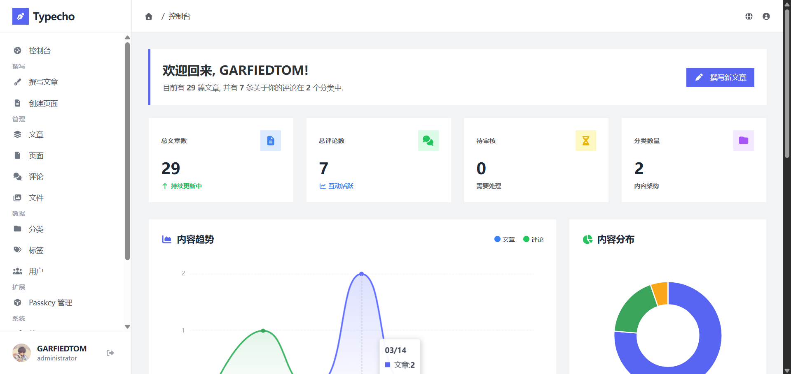
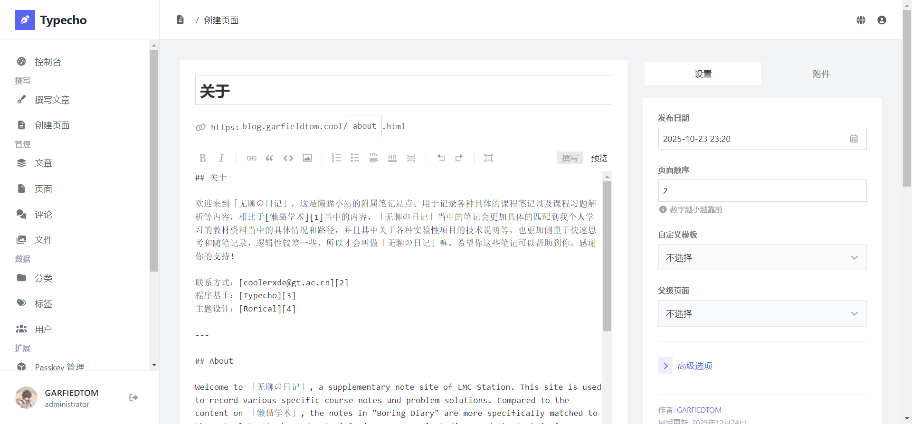
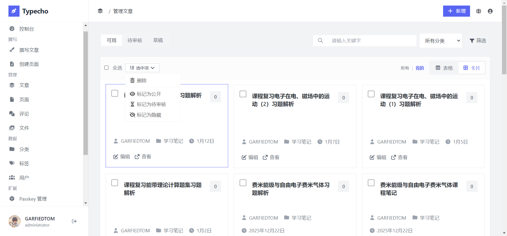
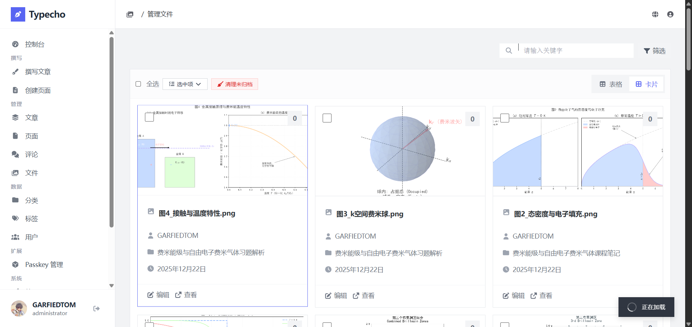
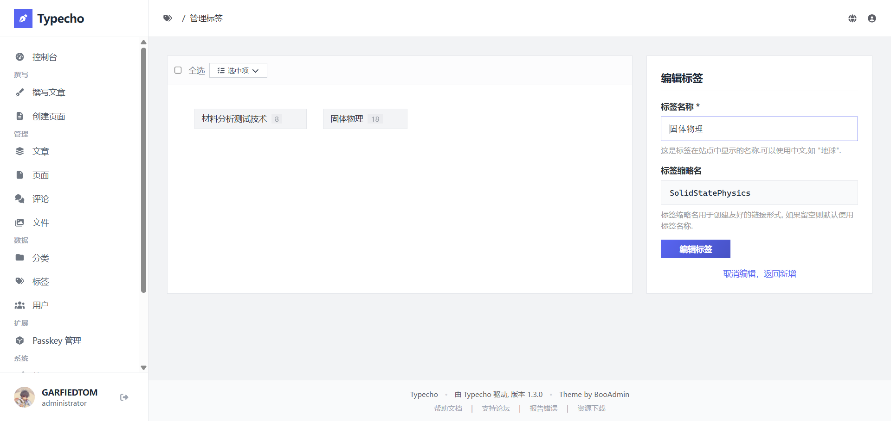
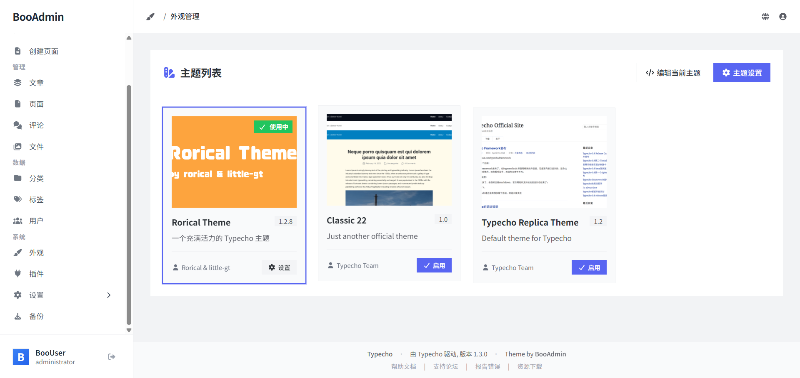
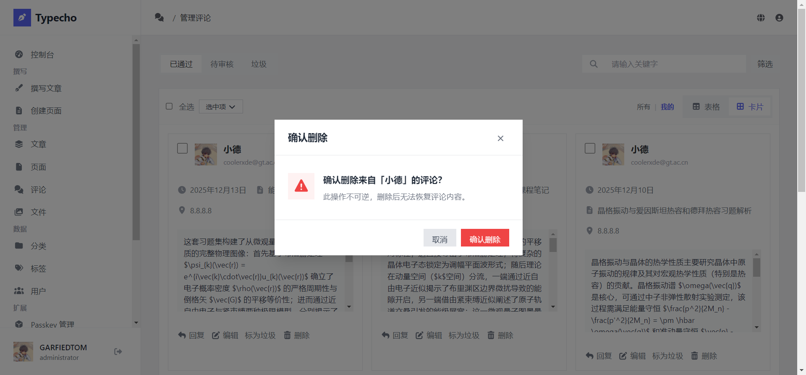
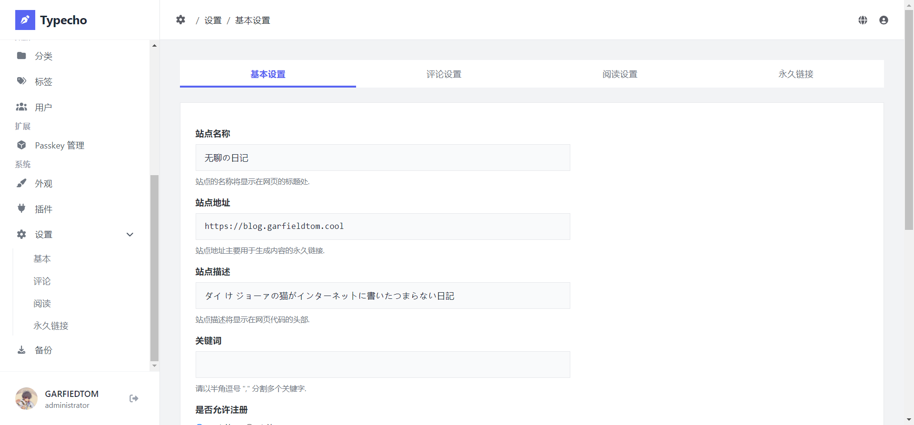

# BooAdmin Theme for Typecho

> **高效 · 现代 · 极简**

一款使用 TailwindCSS 精心重构的 Typecho 现代化后台主题。完全支持 Typecho 1.3.0，采用国内阿里云 CDN 加速资源，提供业界领先的加载速度和用户体验。

参与讨论：https://forum.typecho.org/viewtopic.php?p=62494#p62494

了解找回密码：https://github.com/little-gt/PLUGION-Passport

了解通行秘钥：https://github.com/little-gt/PLUGION-Passkey

---

## 📸 截图预览

### 控制台仪表盘

### 撰写文章

### 管理文章

### 管理文件

### 管理标签

### 主题设置

### 插件设置

### 系统设置页面

---

## ✨ 核心更新

### 🎨 TailwindCSS 完全重构
BooAdmin v1.1.1 采用业界领先的 **TailwindCSS** 框架进行完全重构，相比传统 CSS 框架提供：
- **更小的文件体积**: 按需生成 CSS，减少 30% 以上的资源大小
- **更高的开发效率**: 使用 Utility-first 理念，快速构建现代化 UI
- **完全自定义**: 灵活的配置系统，轻松适配您的品牌风格
- **优异的响应式设计**: 原生移动优先设计，完美适配各类设备

### 🚀 阿里云 CDN 资源加速
所有外部资源已全部迁移至 **阿里云 CDN**（国内加速），包括：
- **JavaScript 库**: jQuery、Chart.js、NProgress 等
- **字体资源**: Nunito、FontAwesome 等字体文件
- **图标库**: FontAwesome 6 Free 图标库
- **样式表**: TailwindCSS 核心样式文件

> 这意味着国内用户可以享受 **极速的资源加载体验**，相比国外 CDN 速度提升 3-5 倍！

### 💯 完全兼容 Typecho 1.3.0
- **深度适配**: 针对 Typecho 1.3.0 的最新 API 和数据结构进行全面优化
- **零迁移成本**: 完全保留 Typecho 原生操作习惯，无需学习曲线
- **功能完整**: 所有后台功能模块全量支持，无任何缺失
- **长期支持**: 持续追踪 Typecho 最新版本进展，确保兼容性

---

## 🚀 特性概览

| 功能模块 | 说明 |
| :-- | :-- |
| **TailwindCSS 重构** | 采用现代化 CSS 框架，提供极速响应和卓越性能。 |
| **国内 CDN 加速** | 所有资源使用阿里云 CDN，国内加载速度提升 3-5 倍。 |
| **完全响应式** | 完美适配 PC、平板与手机，随时随地管理博客。 |
| **移动端深度优化** | 🆕 智能识别设备尺寸，移动端自动切换至更友好的卡片视图。 |
| **灵活视图切换** | 🆕 文章管理页支持表格/卡片视图切换，用户偏好自动保存。 |
| **Typecho 1.3.0** | 完全兼容最新版本 Typecho，开箱即用无兼容问题。 |
| **极简设计理念** | 清爽配色与卡片式布局，告别陈旧后台界面，让管理变得优雅。 |
| **代码高亮支持** | 内置主题编辑器支持代码高亮与行号显示。 |
| **开箱即用** | 无需繁琐配置，替换目录即可生效。 |

---

## ⚙️ 安装与升级

**⚠️ 重要提示：操作前请务必备份您的网站数据库和 `admin` 目录！**

### 全新安装
1.  下载本项目的 [最新 Release 版本](https://github.com/little-gt/THEME-BooAdmin/releases)。
2.  解压压缩包。
3.  将解压得到的 `admin` 文件夹上传至您的 Typecho 网站根目录，**覆盖**原有的 `admin` 目录。
4.  登录后台，享受全新的 BooAdmin。

### 从 旧版本 升级
1.  **强烈建议**删除服务器上旧的 `admin` 目录。
2.  上传 v1.1.3 版本的 `admin` 目录到网站根目录。
3.  清理浏览器缓存，以加载最新的 CSS 和 JS 文件。
4.  如果您使用的是 Typecho 1.3.0 或更高版本，升级后所有功能将自动适配。
5.  🆕 移动端访问文章管理页时将自动切换到卡片视图，PC 端保持表格视图。

---

## 🧱 技术栈

### 前端框架与样式
*   **CSS 框架**: TailwindCSS 3.0+ （Utility-first 设计，极速响应）
*   **JavaScript 库**: jQuery 3.x（事件处理与 DOM 操作）
*   **图表组件**: Chart.js（仪表板数据可视化）
*   **进度条**: NProgress 0.2.0（页面加载进度提示）

### 资源与字体
*   **图标库**: FontAwesome 6 Free（1,500+ 精美图标）
*   **英文字体**: Nunito（高质量英文字体优化）

### 资源加速
*   **CDN 提供商**: 阿里云 CDN（国内节点覆盖全国，速度业界领先）
*   **资源加速**: 所有 JavaScript、CSS、字体文件均通过阿里云 CDN 分发
*   **加载优化**: 国内用户相比国外 CDN 速度提升 3-5 倍

---

## 🐛 常见问题

如果您在使用过程中遇到任何问题，请优先尝试以下解决方案：

1.  **菜单高亮不生效**: 请确保 Typecho 版本 >= 1.3.0，并清理浏览器缓存。
2.  **资源加载缓慢**: 这通常是网络问题，BooAdmin 已使用阿里云 CDN 加速，国内用户应该能获得最佳速度。如果仍有问题，请检查您的网络连接。
3.  **样式显示不完整**: 请确保您的 `admin/css/` 目录中包含所有样式文件，并清理浏览器缓存。
4.  **JavaScript 报错**: 请确保没有其他插件修改了全局 JavaScript 环境，并查看浏览器控制台的具体错误信息。

---

## 📋 更新日志

### v1.1.5 版本
- 🔌 **插件页面优化**: 处于第三方拓展页面时，侧边栏会自动取消显示，以免破坏布局；
- 🎨 **搜索框图标样式**: 优化管理页面搜索框的图标样式，提升视觉一致性；
- ⚙️ **设置页面优化**: 改进设置页面的切换设置样式，提供更清晰的视觉反馈；
- 🔧 **Header 统一设计**: 统一各管理页面的 Header 设计，增强整体一致性；
- 📐 **间距调整**: 优化各个属性的间距以及 ul 列表的间距，提升页面布局美观度；
- ✂️ **分割线移除**: 移除多处可能影响视觉的分割线，使界面更加简洁现代。

### v1.1.4 版本
- 🎨 **主页和菜单优化**: 优化了主页和菜单的头像展示，修复了特殊字符渲染异常的问题；
- 🔌 **菜单兼容性提升**: 提升菜单兼容性，优化第三方插件注入和第三方主题注入的兼容；
- 🎯 **主题管理设计优化**: 优化主题管理页面的设计，使得和插件、备份页面的设计相一致；
- 💾 **备份功能独立**: 将备份从设置中移出，并优化了备份页面的设计。

### v1.1.3 版本
- 🎨 **全局通知系统优化**: 重构通知组件样式，采用现代化设计语言，提供更好的视觉反馈和用户体验；
- 🔄 **多页面视图扩展**: 在 v1.1.2 文章管理的基础上，扩展卡片视图到更多管理页面；
  - 📝 **独立页面管理**: 支持表格/卡片视图切换，优化页面层级展示；
  - 💬 **评论管理**: 支持表格/卡片视图切换，更直观地查看评论内容和状态；
  - 📁 **文件管理**: 支持表格/卡片视图切换，提供更好的媒体文件预览体验；
- 💾 **视图偏好持久化**: 所有管理页面的视图选择都会自动保存，跨页面保持一致性；
- 📱 **移动端智能适配**: 各管理页面在移动设备上自动切换到卡片视图，触控操作更友好；
- 🔌 **向后兼容**: 保留对旧版插件和自定义通知的完整兼容性支持；
- 🎯 **用户体验提升**: 统一各管理页面的交互逻辑，提供一致的操作体验；
- 🚀 **性能优化**: 优化视图切换动画和数据渲染性能，确保流畅的使用体验。

### v1.1.2 版本
- 📱 **移动端自适应**: 智能检测设备屏幕尺寸，移动端（<768px）自动切换到卡片视图，提供更友好的浏览体验；
- 🔄 **视图切换功能**: 文章管理页新增表格/卡片视图切换按钮，用户可根据个人喜好自由切换显示方式；
- 💾 **偏好记忆**: 使用 localStorage 自动保存用户选择的视图模式，下次访问自动应用；
- 📐 **响应式调整**: 窗口大小改变时智能调整视图，未设置偏好时自动适配最佳显示模式；
- 🎯 **用户优先**: 一旦用户手动切换视图，系统将记住该偏好，不再自动切换；
- 🚀 **性能优化**: 视图切换采用防抖优化，避免频繁切换造成的性能损耗；
- 📦 **独立模块**: 仅在文章管理页启用视图切换，不影响其他管理页面（后续将逐步扩展到其他页面）。

### v1.1.1 版本
- 🎨 **版权页面优化**: 重新设计版权页面（copyright）的视觉效果，提升专业度；
- 🔄 **页面切换优化**: 优化页面切换动画和过渡效果，提供更流畅的操作体验；
- 📊 **仪表板升级**: 首页仪表板现已使用真实实时数据，提供准确的统计信息；
- 🔐 **登录注册升级**: 全新设计的登录页面和注册页面，提升安全性和用户体验；
- 🐛 **问题修复**: 修复了多个已知问题，提高系统稳定性。

### v1.1.0 版本
- 🎨 **完全重构**: 从 Bootstrap 5 迁移至 TailwindCSS 3.0+，获得更高性能和自定义能力；
- 🚀 **CDN 加速**: 所有资源迁移至阿里云 CDN，国内用户享受 3-5 倍速度提升；
- 💯 **深度优化**: 针对 Typecho 1.3.0+ 进行全面适配和优化；
- 📦 **减少体积**: CSS 文件体积减少 30% 以上，加载更快；
- 🔧 **评论管理**: 修复 jQuery 3.x 中 `$.cookie()` 函数不存在导致的评论管理页面功能失效；
- 🔧 **批量操作**: 修复批量通过、待审核、标记垃圾、删除评论的功能；
- 🔧 **UI 优化**: 清除垃圾评论、删除确认、状态切换等多项功能修复；
- 🛡️ **代码健壮性**: 增强事件绑定、错误处理和兼容性检查。

---

## ❤️ 贡献与反馈

如果您在使用过程中遇到任何问题，或有更好的建议：

1.  欢迎提交 [Issues](https://github.com/little-gt/THEME-BooAdmin/issues) 反馈 BUG。
2.  欢迎提交 Pull Requests 贡献代码。
3.  如果喜欢这个主题，请点亮右上角的 ⭐ **Star** 支持作者！

---

## 🔐 安全策略

如果您发现安全漏洞，请通过安全邮箱 [coolerxde@gt.ac.cn](mailto:coolerxde@gt.ac.cn) 私密报告，不要在 GitHub Issues 中公开披露。详细信息请参阅 [SECURITY.md](SECURITY.md)。

---

**BooAdmin** — TailwindCSS 重构，阿里云 CDN 加速，为您的 Typecho 后台注入现代化活力。
