# BooAdmin Theme for Typecho

> **高效 · 现代 · 极简**

一款使用 TailwindCSS 精心重构的 Typecho 现代化后台主题。完全支持 Typecho 1.3.0，采用国内阿里云 CDN 加速资源，提供业界领先的加载速度和用户体验。

> 因为我现在需要准备毕业设计等内容，并且考虑到 BooAdmin 的功能已经基本上完备了，且 BUG 也修的差不多了，因此，后续可能不会很频繁的看 GitHub 以及处理维护了，请见谅。

---
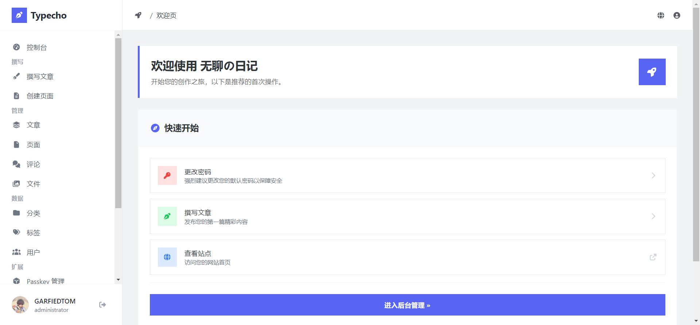

参与讨论：
[Typecho 官方论坛](https://forum.typecho.org/viewtopic.php?p=62530#p62530)

配套插件：
[找回密码插件](https://github.com/little-gt/PLUGION-Passport)
[通行秘钥插件](https://github.com/little-gt/PLUGION-Passkey)

---

## 📸 电脑端预览

点击展开/收起电脑端截图

### 控制台
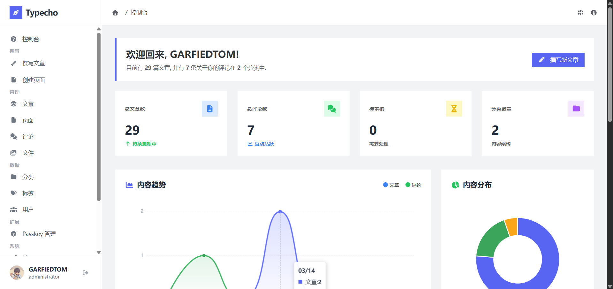

### 撰写文章
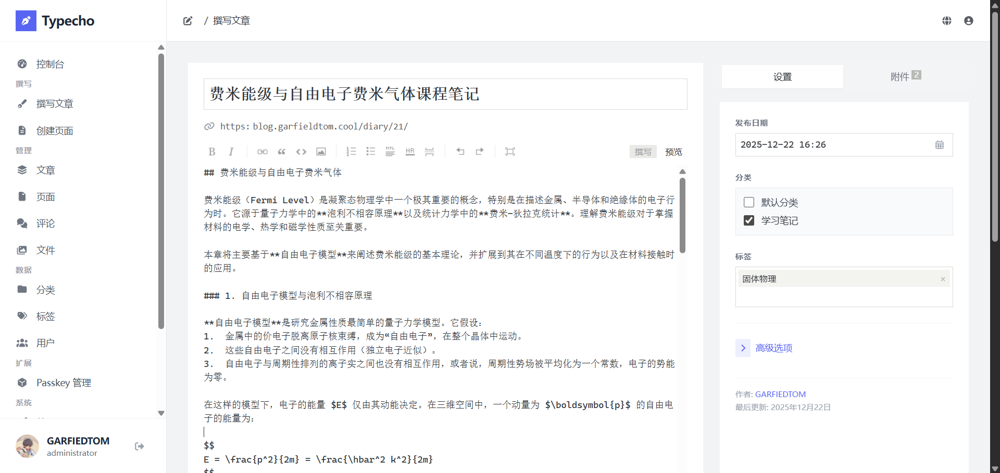
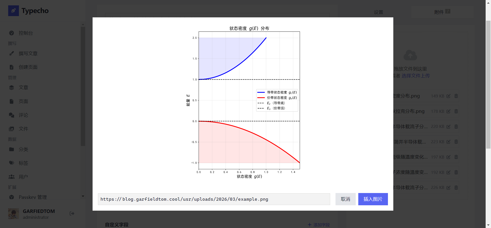

### 管理文章
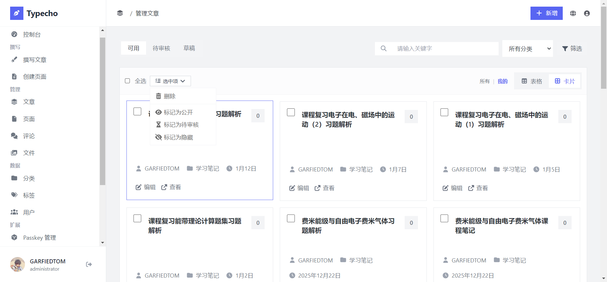

### 管理文件
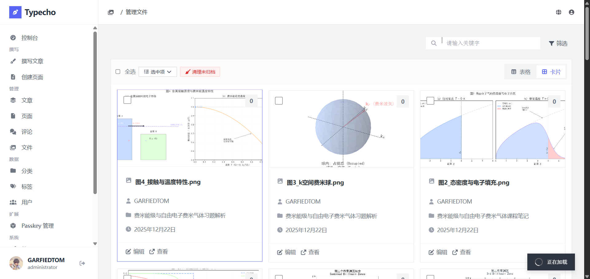

### 管理标签
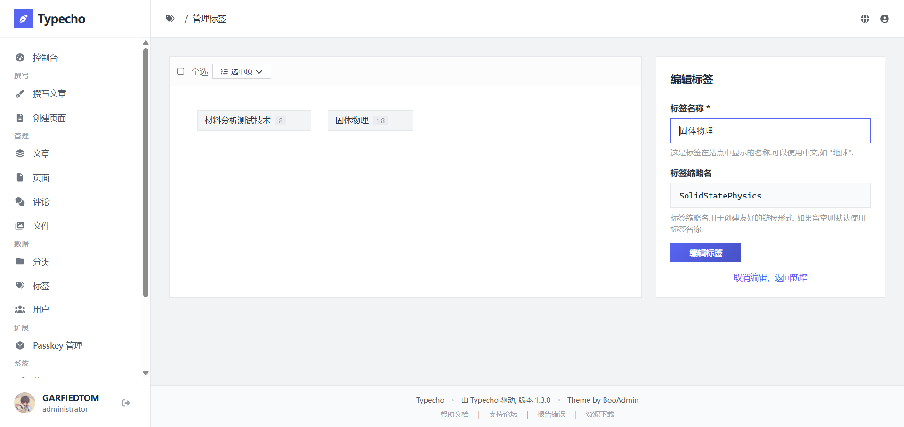

### 主题设置
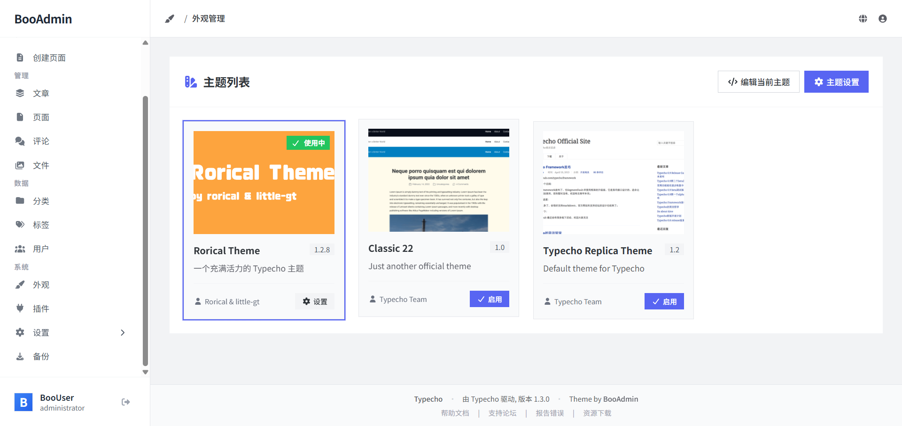

### 管理评论
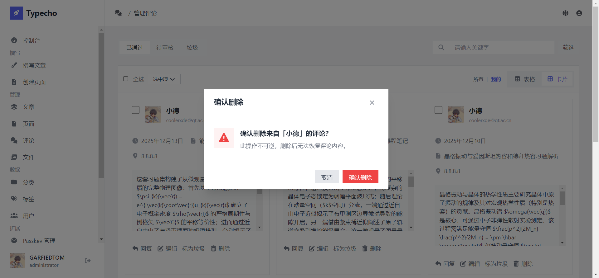

### 系统设置
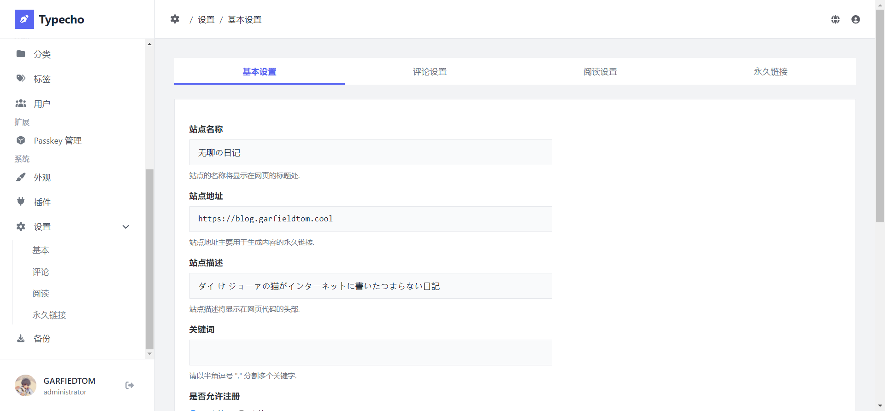

---

## 📱 移动端预览

点击展开/收起移动端截图

### 控制台
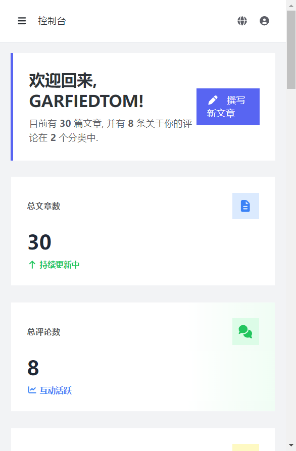

### 撰写文章
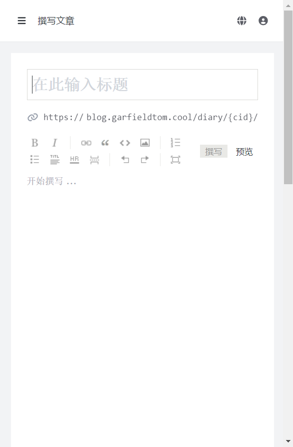

### 管理文章
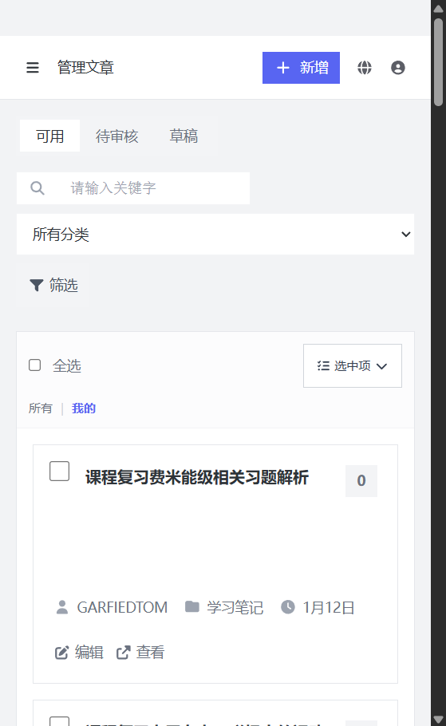

### 管理独立页面
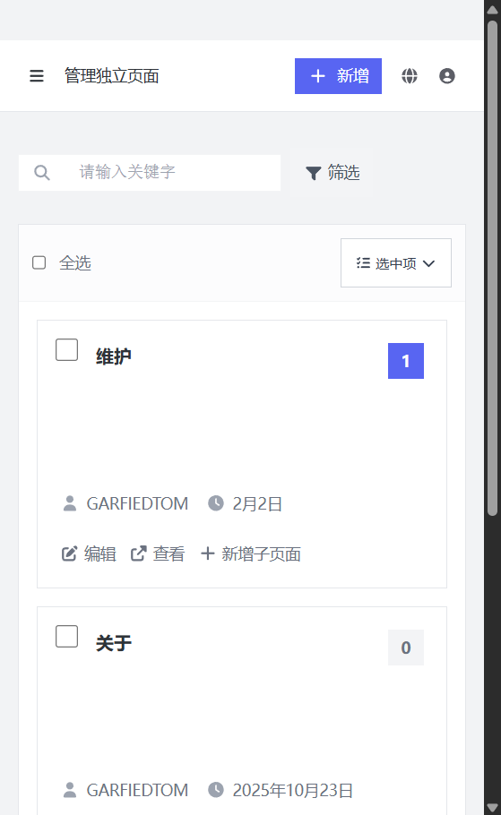

### 管理评论
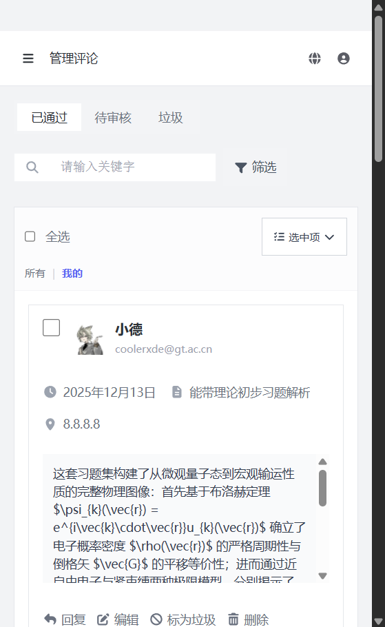

### 管理文件
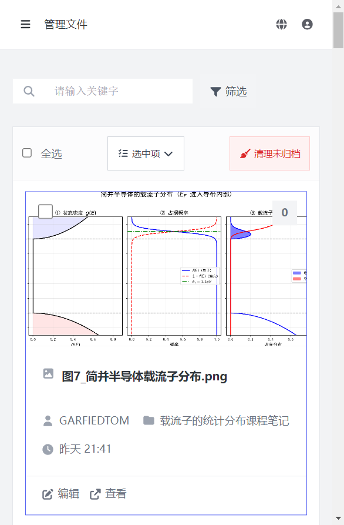

### 插件设置
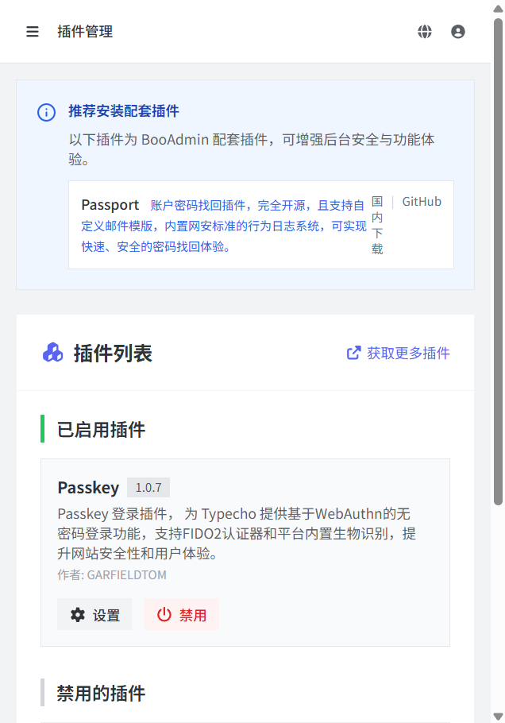

---

## 🚀 v1.1.12 版本更新速递

### 特性优化

- 🎨 **UI 体验提升**：将所有原始浏览器的 `confirm()` 和 `alert()` 弹窗替换为页面内部的 Modal 弹窗，保持设计一致性，提升用户体验。
- 🔧 **链接预览修复**：修复了撰写文章页面的链接预览功能，解决了 http 与 https 协议缺少 `://` 的问题。

### 特别鸣谢

感谢 **莫失·莫忘** 对 BooAdmin 的赞赏和支持！

---

## ⚙️ 安装与升级

**⚠️ 重要提示：操作前请务必备份您的网站数据库和 `admin` 目录！**

### 全新安装

1. 下载 [最新 Release 版本](https://github.com/little-gt/THEME-BooAdmin/releases)。
2. 解压压缩包。
3. 将解压得到的 `admin` 文件夹上传至您的 Typecho 网站根目录，**覆盖**原有的 `admin` 目录。
4. 登录后台，享受全新的 BooAdmin。

### 从旧版本升级

1. **强烈建议**删除服务器上旧的 `admin` 目录。
2. 上传最新版本的 `admin` 目录到网站根目录。
3. 清理浏览器缓存，以加载最新的 CSS 和 JS 文件。
4. 如果您使用的是 Typecho 1.3.0 或更高版本，升级后所有功能将自动适配。
5. 🆕 移动端访问管理页时将自动切换到卡片视图，PC 端保持表格视图。

---

## 🐛 常见问题

如果您在使用过程中遇到任何问题，请优先尝试以下解决方案：

1. **资源加载缓慢**：这通常是网络问题，BooAdmin 已使用阿里云 CDN 加速，国内用户应该能获得最佳速度。如果仍有问题，请检查您的网络连接。
2. **样式显示不完整**：请确保您的 `admin/css/` 目录中包含所有样式文件，并清理浏览器缓存。
3. **JavaScript 报错**：请确保没有其他插件修改了全局 JavaScript 环境，并查看浏览器控制台的具体错误信息。
4. **移动端顶部横条**：移动端顶部的横条（header）为兼容性设计，如果移除，会导致您的插件无法使用甚至 Typecho 的 JavaScript 直接报错。请勿修改或移除该设计元素，其作为侧边栏收缩之后的相对定位和 JavaScript 注入点存在。这就是为什么 PC 端部没有设计侧边栏收缩的原因。
5. **插件配合使用**：建议配合插件一同使用，插件和主题深度集成，可以获得更好的功能体验和视觉一致性。

---

## 🧱 技术栈

### 前端框架与样式

| 组件 | 说明 |
| ---- | ---- |
| CSS 框架 | TailwindCSS 3.0+ — Utility-first 设计，按需生成，体积小，响应快 |
| JavaScript 库 | jQuery 3.x — 事件处理与 DOM 操作 |
| 图表组件 | Chart.js — 仪表盘数据可视化 |
| 进度条 | NProgress 0.2.0 — 页面加载进度提示 |

### 资源与字体

| 资源 | 说明 |
| ---- | ---- |
| 图标库 | FontAwesome 6 Free — 丰富图标集合（Free 版本） |
| 字体 | Nunito (Google Fonts) — 清晰优雅的英文字体，通过 Google Fonts 提供统一的视觉体验 |

### 资源加速

| 项目 | 说明 |
| ---- | ---- |
| CDN 提供商 | 阿里云 CDN — 国内节点覆盖，访问速度快且稳定 |
| 分发范围 | JavaScript、CSS、字体、图标等静态资源通过 CDN 分发 |
| 性能提升 | 面向国内用户，相比国外 CDN 可提升加载速度约 3–5 倍 |

---

## ❤️ 贡献与反馈

如果您在使用过程中遇到任何问题，或有更好的建议：

1. 欢迎提交 [Issues](https://github.com/little-gt/THEME-BooAdmin/issues) 反馈 Bug。
2. 欢迎提交 Pull Requests 贡献代码。
3. 如果喜欢这个主题，请点亮右上角的 ⭐ **Star** 支持作者。

---

## 🔐 安全策略

如果您发现安全漏洞，请通过安全邮箱 [coolerxde@gt.ac.cn](mailto:coolerxde@gt.ac.cn) 私密报告，不要在 GitHub Issues 中公开披露。详细信息请参阅 [SECURITY.md](SECURITY.md)。

---

**BooAdmin** — TailwindCSS 重构，阿里云 CDN 加速，为您的 Typecho 后台注入现代化活力。