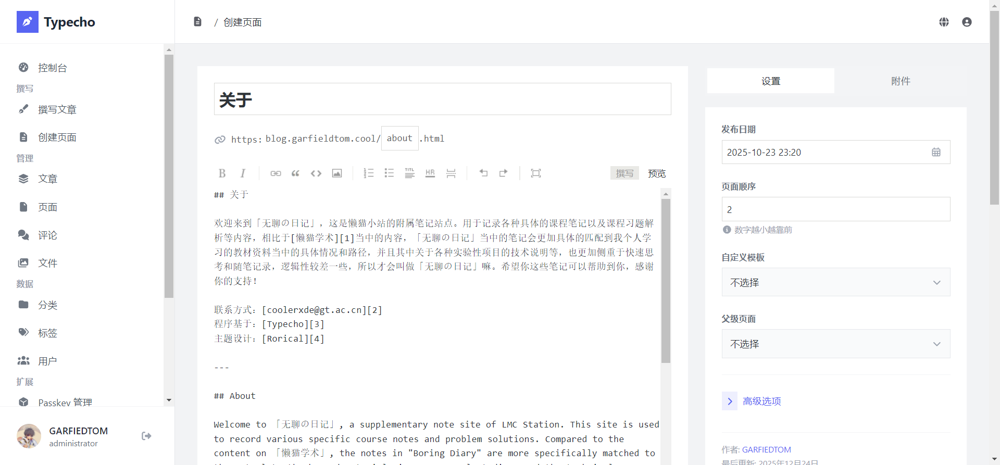

# BooAdmin Theme for Typecho

> **高效 · 现代 · 极简**

一款使用 TailwindCSS 精心重构的 Typecho 现代化后台主题。完全支持 Typecho 1.3.0，采用国内阿里云 CDN 加速资源，提供业界领先的加载速度和用户体验。

---

参与讨论：[Typecho 官方论坛](https://forum.typecho.org/viewtopic.php?p=62522#p62522)

了解更多：
[找回密码插件](https://github.com/little-gt/PLUGION-Passport)
[通行秘钥插件](https://github.com/little-gt/PLUGION-Passkey)

---

## 📸 截图预览

### 欢迎页面

### 控制台仪表盘

### 撰写文章

### 管理文章

### 管理文件

### 管理标签

### 主题设置

### 管理评论

### 系统设置页面

---

## 🚀 v1.1.9 版本更新速递

- ⏳ **加载指示器优化**：调整加载指示器位置到页面右下角，并提升其视觉效果。
- ⚙️ **主题编辑器优化**：支持全屏编辑，并在保存时增加二次确认。
- 🖼️ **欢迎页面优化**：提升欢迎页面的视觉设计和用户体验。
- 🔧 **升级页面优化**：优化升级流程和界面设计。
- 💬 **评论弹窗优化**：统一评论管理器的弹窗设计，使其更加简洁。
- 🎨 **管理页面优化**：优化整体代码和视觉设计，提升一致性。

---

## ✨ 核心更新

### 🎨 TailwindCSS 完全重构

BooAdmin v1.1.x 系列版本采用业界领先的 **TailwindCSS** 框架进行完全重构，提供：
- **更小的文件体积**：按需生成 CSS，减少 30% 以上的资源大小。
- **更高的开发效率**：使用 Utility-first 理念，快速构建现代化 UI。
- **完全自定义**：灵活的配置系统，轻松适配您的品牌风格。
- **优异的响应式设计**：原生移动优先设计，完美适配各类设备。

### 🚀 阿里云 CDN 资源加速

所有外部资源已迁移至 **阿里云 CDN**（国内加速），包括：
- **JavaScript 库**：jQuery、Chart.js、NProgress 等。
- **字体资源**：Nunito、FontAwesome 等字体文件。
- **图标库**：FontAwesome 6 Free 图标库。
- **样式表**：TailwindCSS 核心样式文件。

> 国内用户可享受 **极速的资源加载体验**，相比国外 CDN 速度提升 3-5 倍！

### 💯 完全兼容 Typecho 1.3.0

- **深度适配**：针对 Typecho 1.3.0 的最新 API 和数据结构进行全面优化。
- **零迁移成本**：完全保留 Typecho 原生操作习惯，无需学习曲线。
- **功能完整**：所有后台功能模块全量支持，无任何缺失。
- **长期支持**：持续追踪 Typecho 最新版本进展，确保兼容性。

---

## ⚙️ 安装与升级

**⚠️ 重要提示：操作前请务必备份您的网站数据库和 `admin` 目录！**

### 全新安装

1. 下载 [最新 Release 版本](https://github.com/little-gt/THEME-BooAdmin/releases)。
2. 解压压缩包。
3. 将解压得到的 `admin` 文件夹上传至您的 Typecho 网站根目录，**覆盖**原有的 `admin` 目录。
4. 登录后台，享受全新的 BooAdmin。

### 从旧版本升级

1. **强烈建议**删除服务器上旧的 `admin` 目录。
2. 上传最新版本的 `admin` 目录到网站根目录。
3. 清理浏览器缓存，以加载最新的 CSS 和 JS 文件。
4. 如果您使用的是 Typecho 1.3.0 或更高版本，升级后所有功能将自动适配。
5. 🆕 移动端访问管理页时将自动切换到卡片视图，PC 端保持表格视图。

---

## 🧱 技术栈

### 前端框架与样式

| 组件 | 说明 |
| ---- | ---- |
| CSS 框架 | TailwindCSS 3.0+ — Utility-first 设计，按需生成，体积小，响应快 |
| JavaScript 库 | jQuery 3.x — 事件处理与 DOM 操作 |
| 图表组件 | Chart.js — 仪表盘数据可视化 |
| 进度条 | NProgress 0.2.0 — 页面加载进度提示 |

### 资源与字体

| 资源 | 说明 |
| ---- | ---- |
| 图标库 | FontAwesome 6 Free — 丰富图标集合（Free 版本） |
| 字体 | Nunito — 清晰优雅的英文字体，适合后台界面 |

### 资源加速

| 项目 | 说明 |
| ---- | ---- |
| CDN 提供商 | 阿里云 CDN — 国内节点覆盖，访问速度快且稳定 |
| 分发范围 | JavaScript、CSS、字体、图标等静态资源通过 CDN 分发 |
| 性能提升 | 面向国内用户，相比国外 CDN 可提升加载速度约 3–5 倍 |

---

## 🐛 常见问题

如果您在使用过程中遇到任何问题，请优先尝试以下解决方案：

1. **菜单高亮不生效**：请确保 Typecho 版本 >= 1.3.0，并清理浏览器缓存。
2. **资源加载缓慢**：这通常是网络问题，BooAdmin 已使用阿里云 CDN 加速，国内用户应该能获得最佳速度。如果仍有问题，请检查您的网络连接。
3. **样式显示不完整**：请确保您的 `admin/css/` 目录中包含所有样式文件，并清理浏览器缓存。
4. **JavaScript 报错**：请确保没有其他插件修改了全局 JavaScript 环境，并查看浏览器控制台的具体错误信息。

---

## ❤️ 贡献与反馈

如果您在使用过程中遇到任何问题，或有更好的建议：

1. 欢迎提交 [Issues](https://github.com/little-gt/THEME-BooAdmin/issues) 反馈 Bug。
2. 欢迎提交 Pull Requests 贡献代码。
3. 如果喜欢这个主题，请点亮右上角的 ⭐ **Star** 支持作者。

---

## 🔐 安全策略

如果您发现安全漏洞，请通过安全邮箱 [coolerxde@gt.ac.cn](mailto:coolerxde@gt.ac.cn) 私密报告，不要在 GitHub Issues 中公开披露。详细信息请参阅 [SECURITY.md](SECURITY.md)。

---

**BooAdmin** — TailwindCSS 重构，阿里云 CDN 加速，为您的 Typecho 后台注入现代化活力。
